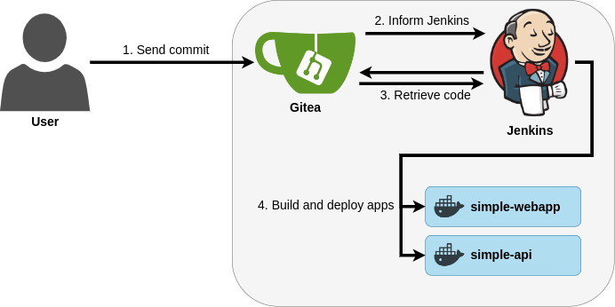
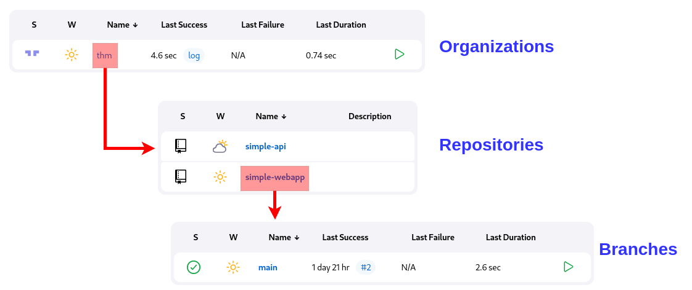
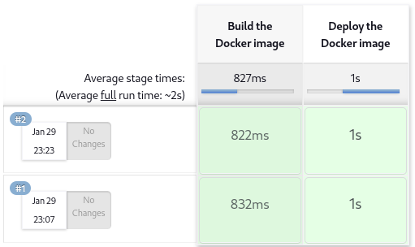
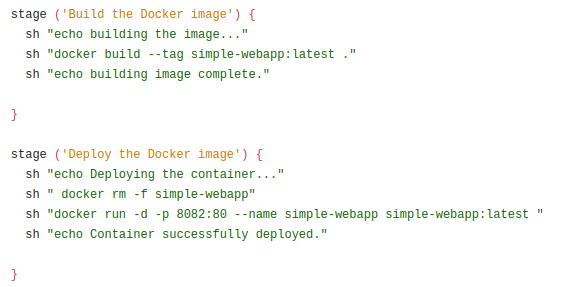
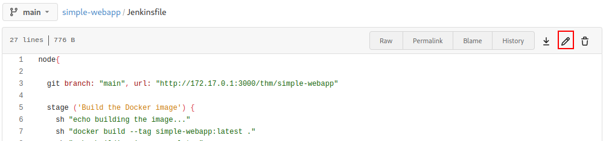
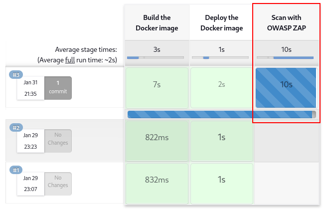
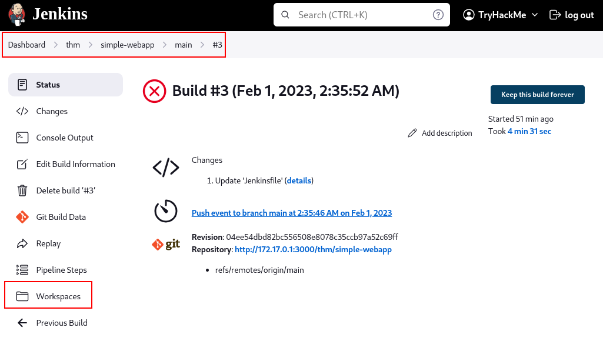

# DAST

## Topic 1 - Dynamic Application Security Testing (DAST)

### What is DAST?
Dynamic Application Security Testing (DAST) involves testing a running web application to identify vulnerabilities using a black-box approach, simulating an attacker’s perspective. It complements other security techniques and focuses on runtime vulnerabilities.

### Manual vs. Automated DAST
- **Manual DAST**: Security engineers manually test applications for vulnerabilities.
- **Automated DAST**: Tools perform scans to detect weaknesses quickly.
- **Combined Approach**: Both methods are used for comprehensive results during the Software Development Lifecycle (SDLC).

### DAST in the SDLC

<p align="center"></p>

- Automated DAST is used in testing phases for quick feedback.
- Manual scans are periodic for deeper analysis.
- A full web application pentest is recommended before production.

### Pros
- Detects runtime and deployment-specific vulnerabilities.
- Handles vulnerabilities across all programming languages.
- Reduces false positives compared to SAST.
- Can identify business logic flaws (tool capabilities dependent).

### Cons
- Limited code coverage and difficulty crawling JavaScript-heavy apps.
- Slower scans and lack of detailed remediation guidance.
- Requires a running application for testing.

### Tools
DAST tools typically perform spidering/crawling and vulnerability scanning. Examples:
- **ZAP Proxy**: Open-source tool.
- Enterprise tools with dashboards and integration features.

---

## Topic 2 - Spiders and Crawlers

### Spidering an App with ZAP

#### Overview
Spidering in ZAP maps all resources in a web application by navigating from a starting page and following detected links.

#### Regular Spidering
1. Go to **Tools -> Spider** and specify the target URL (e.g., `http://MACHINE_IP:8082/`).
2. Configure optional settings:
   - **Recurse**: Recursively follow links.
   - **Spider Subtree Only**: Limit to subfolders.
   - **Advanced Options**: Fine-tune parameters.
3. Start the scan and view results in the **Sites** tab.

**Limitations**: Cannot detect links generated dynamically by JavaScript (e.g., `/nospiders-gallery.php`).

#### AJAX Spidering
To handle dynamic links:
1. Go to **Tools -> AJAX Spider**.
2. Specify the starting URL and select a browser (e.g., Firefox).
3. Start the scan to populate dynamically generated links in the **Sites** list.

---

## Topic 3 - Scanning for Vulnerabilities

### Configuring a Scan Policy in ZAP

#### Why Customize a Scan Policy?
Customizing a scan policy ensures relevant tests are performed, reducing scan time and irrelevant findings.

#### Steps to Configure
1. **Access the Scan Policy Manager**:
   - Go to **Analyse -> Scan Policy Manager**.
   - Click **Add** to create a new policy.
2. **Configure Parameters**:
   - **Threshold**: 
     - Lower: More findings, higher false positives.
     - Higher: Fewer findings, higher confidence.
     - OFF: Disable irrelevant categories.
   - **Strength**: Higher strength increases coverage but prolongs scan times.
3. **Adjust Policy for Application**:
   - Disable irrelevant categories (e.g., SQL Injection, XML processing).
   - Skip resource-intensive tests if not applicable.

#### Running a Scan
1. Go to **Tools -> Active Scan**.
2. Select a starting point and custom scan policy.
3. Enable **Recurse** to scan linked pages.
4. Click **Start Scan** and review alerts in the **Alerts** section.

---

## Topic 4 - Authenticated Scans

### Steps to Configure Authenticated Scans in ZAP
1. **Disable ZAP HUD**: Prevent issues during recording.
2. **Record a ZEST Script**:
   - Click **Record a New ZEST Script** and set the script type to Authentication.
   - Log in manually to the target application.
   - Save and refine the script.
3. **Create a Context**:
   - Right-click the base URL and select **Include in Context > New Context**.
   - Load your ZEST script and add a dummy user.
4. **Re-spider with Authentication**:
   - Select the context and user.
   - Re-spider the application to discover protected resources.
5. **Exclude Logout URLs** and set session indicators to maintain session integrity.

---

## Topic 5 - Checking APIs with ZAP

### Challenges in Testing APIs
- API endpoints don't expose other endpoints, requiring endpoint names and parameters for testing.

### Approach
- Use detailed API specifications (OpenAPI, SOAP, GraphQL) for security testing.

### Using OpenAPI in ZAP
1. Import API definitions (file or URL, e.g., `http://MACHINE_IP:8081/swagger.json`).
2. Populate endpoints in the **Sites** tab.
3. Perform active scans by right-clicking the API URL and selecting **Attack -> Active Scan**.

---

# Topic 6 - Integrating DAST into the Development Pipeline

Generally, when discussing DAST, people will refer to implementing automated vulnerability scanning into your development pipeline rather than the manual process we have covered. In this way, the term differs from what you would typically call application pentesting.

Having DAST added to your development process may sound pretty straightforward, but there are some caveats to it:

- We must decide at which stages of the development process we will run scans.
- We must decide what will trigger a scan. We can run scans on each commit made to code or on a scheduled basis.
- We must determine the intensity of each scan. Doing a full vulnerability scan on a medium-sized application will require significant time, and we don't want to slow down the development team.

Since no solution fits all scenarios, determining all of this must be done with the help of the development team so that security requirements are met without actually creating significant disturbances to their established processes.

In this task, we'll examine how we can quickly implement DAST directly into the development pipeline to provide early visibility of vulnerabilities. The scans will run automatically on each commit and will test for a subset of vulnerabilities only to avoid introducing long delays in the pipeline.

## Reviewing our CI/CD Pipeline

Our current machine implements the entire development pipeline for the web application and API you scanned previously. The following two components are in charge of doing that:

- A Gitea repository is running on `http://MACHINE_IP:3000/`, where the code for both applications is stored.
- A Jenkins instance that runs the CI/CD pipeline. You can access Jenkins at `http://MACHINE_IP:8080/`.

Every time a commit is made in Gitea, Jenkins will take the code from the repository and compile it into a Docker instance. These Docker instances are what you have scanned so far.

<p align="center"></p>

## Running Automated Scans With zap2docker

To integrate ZAP in our pipeline, we will use `zap2docker`, a dockerized version of ZAP proxy built with automation as its primary purpose. The full documentation for zap2docker can be found [here](https://www.zaproxy.org/).

> **Note:** The commands in this section are provided for reference only. You don't need to run them manually, as we will have Jenkins do it for us later.

To install zap2docker, you can pull it from Docker Hub using the following command:

```bash
docker pull owasp/zap2docker-stable
```

You can run ZAP from the docker instance using one of the packaged scan scripts, which will allow you to run one of the following scan profiles:

- **Baseline Scan**: ZAP will spider the target website for a maximum time of 1 minute. No active scan will be performed. You can optionally run an AJAX spider if desired.

  ```bash
  docker run -t owasp/zap2docker-stable zap-baseline.py -t https://www.example.com
  ```

- **Full Scan**: ZAP will run a spider with no time limits, followed by an active scan.

  ```bash
  docker run -t owasp/zap2docker-stable zap-full-scan.py -t https://www.example.com
  ```

- **API Scan**: ZAP will perform an active scan against an API. You will need to provide a URL to an API description file (OpenAPI, GraphQL, or SOAP).

  ```bash
  docker run -t owasp/zap2docker-stable zap-api-scan.py -t https://www.example.com/swagger.json -f openapi
  ```

In any of the scans, the results for passive scans will be limited to 10 alerts. In addition to the base commands, you can add the `-j` switch to perform an AJAX scan on the baseline and full scans.

## Integrating ZAP Into the Pipeline

The environment you have access to already has a zap2docker instance ready to use. All we need to do is to tell Jenkins to run zap2docker with the options we need, and that will be it.

Before going into that, let's explore what we have in Jenkins. When logging into Jenkins, you will find an organization called `thm`, which contains the two repositories for the web application and API. For each of the repositories, you can see the available branches.

<p align="center"></p>

### Organization, Repositories, and Branches

You will have a single branch in both projects called `main`. If you click on the branch, you will be able to see the builds for it. The `simple-webapp` project, for example, has been built two times already:

<p align="center"></p>

For each build, we can see there are two stages configured:

1. **Build the Docker image**: This stage will build the Docker container based on the Dockerfile on each project.
2. **Deploy the Docker image**: This stage will deploy the Docker container.

Both of these stages are defined in the Jenkinsfile in each repository. If we go to Gitea and open the Jenkinsfile on the `simple-webapp` repository, we can see the specific commands run on each of the stages:

<p align="center"></p>

In the second stage, you can see how the web application you scanned manually is deployed to port `8082`, for example.

If we want to incorporate `zap2docker` into our pipeline, we can add a third stage that runs the scan for us after building the container. For your convenience, the stage is already defined at the end of the Jenkinsfile, and you can uncomment it to get it running. Feel free to use git to send a commit to the repository or use Gitea's built-in editor if you find it easier.

<p align="center"></p>

Notice that we are running the **Baseline Scan** only, as this scan will be run for each commit made to the repository, so it isn't sensible to delay the pipeline with a Full Scan that might take hours to finish. This scan intends to find low-hanging fruit only. This means you won't see any SQL injection, Cross-Site Scripting, or anything else that requires an active scan.

Since Jenkins will catch any changes in the repository, it will start the building process immediately after you edit the file. You can switch back to the `simple-webapp` project in Jenkins to see the progress live:

<p align="center"></p>

You can see that the current build now adds the **Scan with OWASP ZAP** stage. The scan will take around 5 minutes. Once finished, the build will fail, as ZAP will find some vulnerabilities in the app. To check the report, open the build and go to the Workspaces section on the menu:

<p align="center"></p>

Here you can explore the project files, and ZAP will put its reports in the `zap-reports` folder. Download and examine the report to answer the question at the end of the task.

> **Note:** You should right-click and save the report before opening it. Opening it directly from Jenkins will break the formatting.

Repeat the same process to enable ZAP on the `simple-api` repository and get the corresponding report. Use the report to answer the questions at the end of this task.

# Topic 7 - Conclusion

In this room, we have covered the basics of how DAST works and introduced ZAP proxy as a tool that can perform DAST in manual and automated ways. DAST is only one of many ways to check for applications' vulnerabilities and should be used in tandem with other types of testing like SAST, SCA, penetration tests, and others to guarantee a reasonable security level for our applications. As with any other technique, DAST won't be a silver bullet solution but will contribute to an application's overall security throughout the software development lifecycle.
