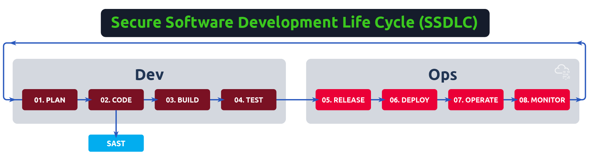

# SAST

## Topic 1 - Code Review

One of the methods used for developing secure applications is frequently testing the code for security bugs through a process known as code review. Code reviews consist of looking at the source code of an application to search for possible vulnerabilities using a white box approach. By having access to the code, the reviewer can guarantee a greater coverage of the application's functionalities and lower the time required to find bugs.

If left unattended, vulnerabilities introduced early in the development process will propagate to the end of a project, where resolution is more laborious and costly. Code reviews will attempt to detect such vulnerabilities early when they are easier to fix.

### Cost of Defects in Software

#### Manual vs Automated Code Review

Code reviews are often done through a combination of manual analysis and automated tools for the best results. Both approaches have advantages that need to be considered when deciding what is best at each stage of the development lifecycle.

On the one hand, manual code reviews have the advantage of a human evaluating the code, which allows for a thorough analysis and more precise results. However, since an application often has thousands and thousands of lines of code, the task can quickly become overwhelming for the reviewer, leading to some vulnerabilities being missed because of fatigue.

On the other hand, automated tools excel at finding common vulnerabilities almost instantly, saving loads of time to the reviewer. Automated tools will also perform consistently, no matter the size of the code base, so they won't miss vulnerabilities as a human could do, as long as they have predefined rules to match them. If the tool has no rules configured for a specific type of vulnerability, they are likely to miss those.

Another important aspect to compare is cost. The cost of a manual review will often be higher, as a reviewer must spend lots of time tracing vulnerabilities through the code. Automated tools will perform their analysis almost instantly.

For these reasons, you will typically want to run automated tests early in the development lifecycle to take care of all the low-hanging fruits with lower costs and have manual reviews spaced periodically or when important project goals are met to take care of complex vulnerabilities that the automated tools may not be able to detect.

## Topic 2 - Manual Code Review

Manual code review is a foundational step in understanding how SAST tools operate by analyzing vulnerabilities directly in the source code. The focus here is on identifying SQL injection vulnerabilities in a simple PHP application.

### Identifying Insecure Functions

Start by locating functions commonly associated with SQL queries, like `mysqli_query()`, using tools such as `grep`. For example, the command:
```
grep -r -n 'mysqli_query('
```
identifies potential SQL injection points.

### Contextual Analysis

Review how functions like `mysqli_query()` are used within the code. Analyze wrapper functions (e.g., `db_query()`) and trace their usage across the application to assess potential vulnerabilities.

### Tracing User Inputs

Map user inputs (e.g., `$_GET`) to SQL queries. Evaluate sanitization techniques like `preg_replace()` to determine their effectiveness against SQL injection.

**Vulnerable Example:**
```php
$sql = "SELECT * FROM table WHERE id=" . $_GET['id'];
```
Direct concatenation of user input leads to SQL injection.

**Properly Sanitized Example:**
```php
$sql2 = "SELECT * FROM logs WHERE id='" . preg_replace('/[^a-z0-9A-Z"]/', "", $_GET['log_id']) . "'";
```
While sanitization appears effective, deeper analysis is required.

## Topic 3 - Automated SAST

SAST involves using automated tools to analyze source code for vulnerabilities during development. While it doesn't replace manual reviews, it simplifies detecting issues early, integrating seamlessly into CI/CD pipelines.

### Key Benefits:
- Operates without running the application.
- Identifies vulnerabilities with high coverage and speed.
- Pinpoints issues in code, reducing review effort.

### Limitations:
- Requires source code (unavailable for third-party apps).
- Can generate false positives.
- Limited to static, language-specific vulnerabilities.

### Core Techniques:
- **Semantic Analysis:** Identifies insecure function usage in localized contexts.
- **Dataflow Analysis:** Traces data from user inputs (sources) to vulnerable functions (sinks) for sanitization gaps.
- **Control Flow Analysis:** Examines code execution order to uncover race conditions or resource issues.
- **Structural Analysis:** Flags insecure cryptographic practices or unused code.
- **Configuration Analysis:** Reviews application configuration files for potential security flaws.

Not all tools implement every technique, so understanding these methods aids in selecting the best solution.

## Topic 4 - SAST with Psalm

This task demonstrates the use of Psalm (PHP Static Analysis Linting Machine) for identifying potential security vulnerabilities in a simple PHP web application. The analysis includes structural and taint analysis to detect programming errors and security issues like SQL injection.

### Steps:

#### Setup:
1. Navigate to the project's directory: `cd /home/ubuntu/Desktop/simple-webapp/`.
2. Confirm the presence of `psalm.xml` for configuration.

#### Running Psalm:
1. Execute a structural analysis:
    ```bash
    ./vendor/bin/psalm --no-cache
    ```
2. Run taint analysis to identify vulnerabilities:
    ```bash
    ./vendor/bin/psalm --no-cache --taint-analysis
    ```

### Key Findings:
- Detected a logical error: incorrect use of the assignment operator in a conditional statement.
- Identified Local File Inclusion (LFI) and SQL Injection vulnerabilities through dataflow analysis.

### Enhancing Detection:
Annotated the `db_query()` function in `db.php` to mark `$query` as a tainted sink:
```php
/**
 * @psalm-taint-sink sql $query
 * @psalm-taint-specialize
 */
function db_query($conn, $query) {
    return mysqli_query($conn, $query);
}
```
Re-running Psalm reported all expected SQL injection instances.

### Dealing with False Positives/Negatives:
- Psalm's annotations improved vulnerability detection accuracy.
- Adjustments to configuration and annotations ensured better clarity in reports.

### Key Learnings:
- SAST tools like Psalm are effective in identifying vulnerabilities and structural errors.
- Proper configuration and annotations enhance the tool's accuracy and relevance.

## Topic 5 - SAST Integration in Development Cycle

<p align="center"></p>

### CI/CD Integration:
- SAST tools run during pull requests or merges to detect vulnerabilities.
- Scanning pull requests ensures code quality before merging.
- To avoid pipeline delays, scans can be reserved for merges instead of every pull request.

### IDE Integration:
- SAST tools integrated into IDEs allow developers to fix issues during coding.
- This proactive approach saves time by addressing problems early.
- Combining IDE and CI/CD integration is recommended:
  - IDE integration for quick checks and secure coding practices.
  - CI/CD for comprehensive scans like dataflow/taint analysis.

### Custom Setup:
- The SAST setup should align with project needs, balancing speed and coverage.

### SAST in VS Code
Your environment uses the following tools:

- **Psalm:**
  - Real-time structural checks for code in the current file.
  - Integrated via a plugin from the Visual Studio Marketplace.

- **Semgrep:**
  - Scans all project files on VS Code startup.
  - Supports custom rule creation for tailored security checks.

### IDE Features
- **Inline Issue Detection:**
  - Displays alerts directly in code.
  - Hovering over problematic lines provides detailed explanations.

- **Problems Panel:**
  - Lists all detected issues for quick navigation and resolution.

This setup enhances code security and development efficiency. Use the IDE plugins to answer task-related questions, focusing on fixing issues directly during coding.

## Topic 6 - Conclusion

SAST is one of the many techniques we can use to improve the security of our applications while they are still being developed. We have shown how to use Psalm, one of the many available SAST tools and how much time it saves us compared to manual reviews. As with any other automated tool, it is essential to validate the results manually, as false positives may be reported.

Be sure to check the DAST room to learn how Dynamic Analysis complements SAST to strengthen your secure development process.
